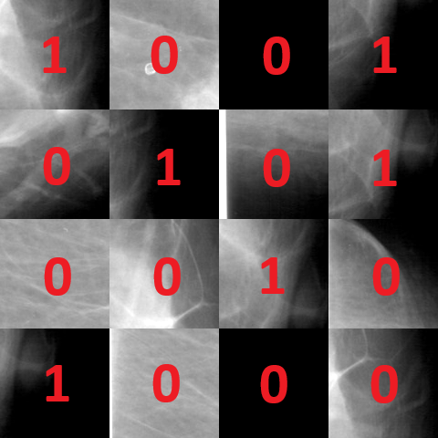

# Nipple Detection on Mammogram

### 0. **Data Description**
A dataset of mammograms is given.  
The dataset has the following structure:

```
root_folder 
    folder_1
        image_1.png
        image_1.png
        ...
        image_n.png
        info.json
    ...
    folder_m
        image_1.png
        ...
        image_q.png
        info.json
```

In info.json file I need the next structure:
```json
{
    "image_name": {
        "nippleRectangle": {
            "corner1": {
                "x": 0,
                "y": 0
            },
            "corner2": {
                "x": 0,
                "y": 0
            }
        },
        "laterality": "L|R",
        "presentationLUT": "IDENTITY|INVERSE"
    }
}
```

### 1. **Algorithm Description**
I have two models for different images in dataset using "presentationLUT" attribute to separate images in two groups.  
For each group steps in algorithm almost identical.  

#### 1.1 **Preprocessing**
Preprocessing Steps:

 * First step is automatically adjust contrast and brightness of every mammogram.  
 <table>
 <tr>
 <td>Original Image</td>
 <td>Automatic Brightness and Contrast Image</td>
 </tr>
 <tr>
 <td></td>
 <td></td>
 </td>
 </table>

 * Next step is flip all mammogram on one side either right or left.
 <table>
 <tr>
 <td>Automatic Brightness and Contrast Image</td>
 <td>Flipped Automatic Brightness and Contrast Image</td>
 </tr>
 <tr>
 <td></td>
 <td></td>
 </td>
 </table>

 * Third step is slicing images to many small intersected images by fixed size box.  
 

 * Next step is label all small images by information in info.json files (prelabeled corners of the box in which it is located nipple) 0 - not have nipple; 1 - have nipple
 (Also need to randomly remove slices that not have nipple in their area to control the ratio between classes 1:4)
 <table>
 <tr>
 <td>Slices</td>
 <td>Labeled Slices (they not having 1 and 0 on actual images :D )</td>
 </tr>
 <tr>
 <td></td>
 <td></td>
 </td>
 </table>

#### 1.2 **Deep Learning (Let's Go)**
On a preprocessing step labeled slices with fixed size have been received.  
Now we can train a deep learning model with convolutional layers in it.  
Our task transforms into Binary classification task to classify if slice has nipple in it or not with a certain threshold (__0.8__).  

Model architecture:  


Loss Function:  
$loss(y, \^{y}, pos\_weight) = -[pos\_weight \times ylog(sigmoid(\^{y})) + (1 - y)log(1 - sigmoid(\^{y}))]$

Learning:  
Stratifyed split our original data on train and validation dataset (4:1). And give before that 10 random folders to a holdout set.  
I used NVIDIA GTX 3060Ti GPU with 8 GB of video RAM for optimization model weights.
Adam optimizer with learning rate: $10^{-4}$. And 1000 epochs with 100 epochs cut-off.


After all we can use our model to get slices with nipple (candidate slices)  
Example of candidate slices (green boxes):  


And we are on a finish line. Next we need to compute intersections between all slices. Find the most dublicated intersection and that is out detection of a nipple on a mammogram. (blue box)  


Next we can show labeled box (red box):  


And compare with our blue box:  
Formula: $\frac{100 \times euclid\_distance(center_b,center_r)}{(image_w \times image_h)}$

### 2. **Results**
I use our holdout set to calculate mean distance in 10 folders of images:

Mean Distance (IDENTITY): 3.014467156536278  
Mean Distance (INVERSE): 4.169648168389946

It is not perfect result. On perfect result we need to get distance in between 0 and 1 I suppose. But in averege both detectors have low accuracy.  
In some cases model can beat even labeled box. In some cases detection is off only a box away from perfect result.

#### What next?
 * I could implement more robust slicing technic and algorithm that finds detection in candidate slices.  
 * I could improve model architecture.
 * I could train on a dedicated cloud servers with GPU a bit more time.

### 3. **Usage**

Clone the repo

```bash
git clone https://github.com/heliosgrounder/Nipple-Detection-on-Mammogram.git
```

Create virtual environment

```bash
python -m venv venv
pip install -r requirement.txt
```

Train the model
```bash
python main.py --mode train 
```

Run the model
```bash
python main.py --mode run
```

## Citations

```bibtex
@INPROCEEDINGS{ 8966022,
  author={Lin, Yuyang and Li, Muyang and Chen, Sirui and Yu, Limin and Ma, Fei},
  booktitle={2019 12th International Congress on Image and Signal Processing, BioMedical Engineering and Informatics (CISP-BMEI)}, 
  title={Nipple Detection in Mammogram Using a New Convolutional Neural Network Architecture}, 
  year={2019},
  volume={},
  number={},
  pages={1-6},
  keywords={Mammography;Training;Convolution;Breast;Deep learning;Adaptation models;Nipple detection;Mammogram;Deep learning;Convolutional neural network},
  doi={10.1109/CISP-BMEI48845.2019.8966022}}
```